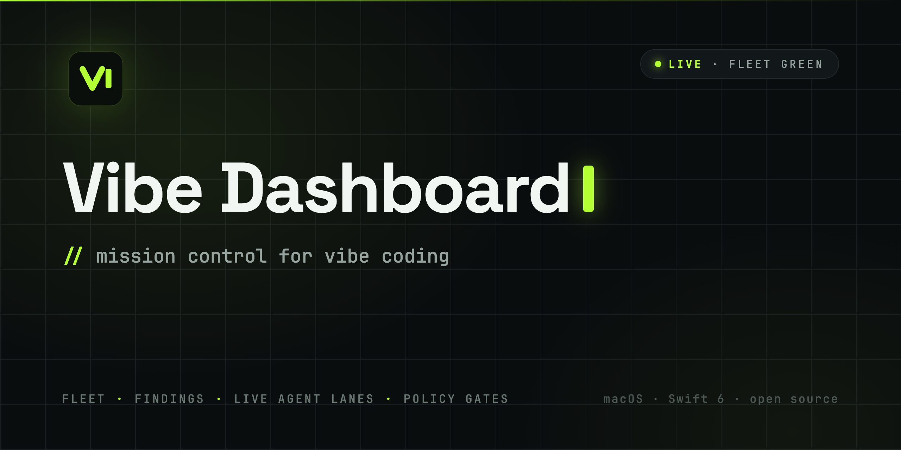
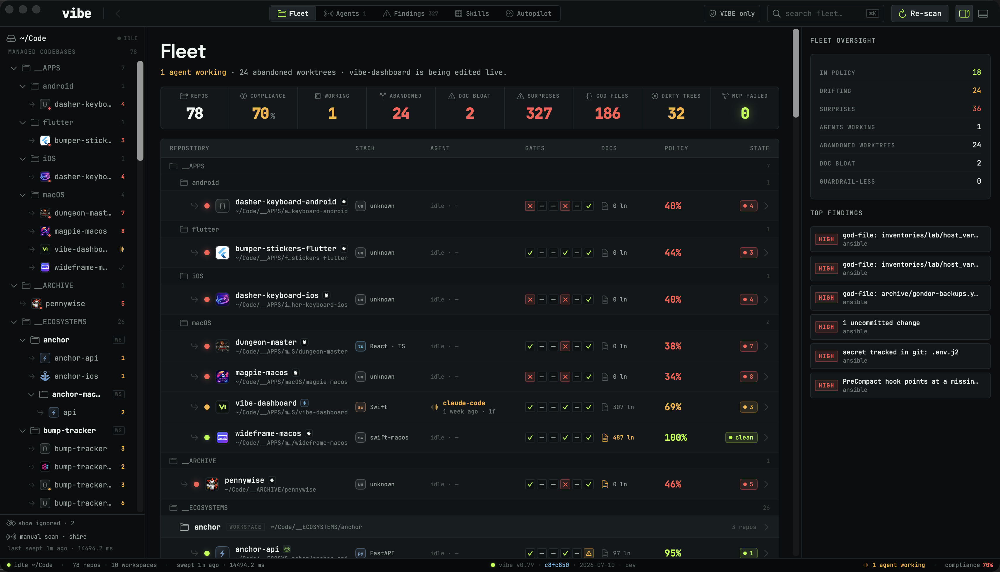

<p align="center">
  
</p>

<p align="center">
  <a href="https://github.com/rex/vibe-dashboard/actions/workflows/ci.yml"></a>
  
  
  
  <a href="LICENSE"></a>
</p>

**You kicked off three Claude Code sessions, a Codex run, and a 40-agent
workflow before lunch. Who's watching them?**

Vibe Dashboard is a native macOS console that watches a fleet of agentic
repositories — and the AI coding agents editing them — **in real time**. Every
repo is scored against its own `VIBE.yaml` policy plus everything only a local
app can see: live agent sessions, git worktree sprawl, unpushed work, doc
bloat, changelog staleness, leaking configs, lifecycle hooks, MCP servers.
When an agent fans out a multi-agent workflow, you watch **every lane stream
at once**.

It runs on one inviolable contract: **nothing fake is shown as real.** Every
number is measured or honestly labelled "not measured" — never fabricated,
never a guess dressed up as a fact. An oversight tool you can't trust is worse
than no tool.

<p align="center">
  
</p>

---

## Watch your agents work

The signature feature. Vibe detects running **Claude Code** and **Codex**
sessions from their transcripts on disk (not `ps` guessing), and opens a live
watch window:

- **Concurrency lanes, not pane soup** — a workflow's lanes map to its
  concurrency slots. When one agent finishes and the next phase starts, the
  stream *continues in place* behind a loud in-stream `hop · stage k` divider.
  No scattered panes, no mashed-together streams.
- **Real transcript rendering** — block markdown, thinking ghosted,
  `tool_use`/`tool_result` paired into one collapsible row that shows *running*
  until the result lands.
- **Push, not poll** — FSEvents drives ~150 ms watch-pane ticks and instant
  fleet updates. Incremental byte-offset tailing follows a 23 MB transcript in
  O(new bytes).
- **Honest lifecycle** — sessions age ACTIVE → IDLE → gone by real activity; a
  workflow's subagents extend their parent's liveness so nothing "completes"
  while its children still stream.

## Fleet health at a glance

- **One severity-weighted grade per repo** with a **"why this grade"**
  breakdown listing every deduction. The factor list *is* the grade — they can
  never disagree.
- **Criticals force danger**: unmanaged repo, unparseable policy, merge-conflict
  markers, tracked secrets, an unguarded live agent.
- **Hygiene detection tuned against alert fatigue** — conflict markers
  (line-anchored), tracked secrets (only when file *contents* actually leak
  credentials), committed dependency dirs, forgotten stashes, god-files,
  skeleton drift. A red dot must mean something.
- **Waivers that mean something** — waive a finding and its weight leaves the
  grade instantly, with disclosure and auto-expiry. Group findings by codebase,
  filter by type, act on them (exclude from scope, append to `.gitignore`,
  generate a fix prompt for your agent).
- **Real actions, confirm-gated** — commit + push, worktree pruning (refuses
  anything unpushed), hook installs — streamed into an in-app console, never
  `--no-verify`, never `--force`.

## The `VIBE.yaml` harness

Each repo declares its own policy in a `VIBE.yaml` at the root — the contract
an agent (or a human) is supposed to work under. Vibe's own policy, abridged:

```yaml
kind: vibe-policy
project:
  name: vibe-dashboard
  stack: swift-apple
architecture:
  check_command: make check-architecture
  max_lines_per_file: { soft: 250, hard: 400 }
  exclude_globs: ["**/Generated/**"]
quality_gates:
  tests: { mode: required }
  clean_worktree_required_on_completion: true
security:
  destructive_confirmation: required
workflow:
  signed_commits_required: true
  push_after_each_commit_if_remote_exists: true
  validation_command: make validate
docs:
  task_state_required: true      # a durable dev journal, agent-maintained
```

The scanner keeps only **managed** repos (those carrying a `VIBE.yaml`,
`AGENTS.md`, or workspace marker), probes each one — git state, file census,
docs, hooks, MCP config, policy gates, agent sessions — and grades it against
its own declared rules. `compliance = 100 − Σ deductions`; health comes from
score bands.

Vibe Dashboard eats its own dog food: it is policy-managed, gate-enforced, and
files stay under the same hard 400-line limit it measures — **the app enforces
the limit it enforces on you.**

### The agentic-skeleton

The fleet this app was built to oversee runs on **agentic-skeleton** — a repo
scaffold that gives every project the same operating system for agentic work:
a `VIBE.yaml` policy, universal `make` verbs (`build` / `test` / `validate`),
git hooks, dev journals, versioning discipline, and a library of stack-specific
skills. The skeleton and its skills library are being open-sourced next; Vibe
Dashboard doesn't require them — **any repo with a `VIBE.yaml` is a citizen.**

## Install

**[Download the latest DMG from Releases](https://github.com/rex/vibe-dashboard/releases)** —
Developer ID-signed, notarized, and stapled, so Gatekeeper opens it without
drama. In-app updates arrive via [Sparkle](https://sparkle-project.org)
(EdDSA-signed appcast + notarization, double-gated).

> **Not sandboxed, on purpose.** Vibe reads arbitrary repos under `~/Code` and
> shells out to `git` / `make`, which the App Sandbox forbids. That's also why
> it will never be a Mac App Store app. See [docs/RELEASE.md](docs/RELEASE.md).

### Build from source

```bash
brew install xcodegen     # one-time
make run                  # generate project → build → launch
make test                 # unit tests (Swift Testing)
make validate             # build · test · lint · architecture · docs · audit — the gate
```

Requires macOS 14+ and Xcode 16+. `project.yml` is the source of truth; the
`.xcodeproj` is regenerated by [xcodegen](https://github.com/yonaskolb/XcodeGen)
and git-ignored — never hand-edit the project file.

## How it works

```
Shared/
  Scan/       discovery → per-repo probes (git, census, docs, hooks, mcp,
              policy, hygiene) → agent-session detection → derived grades.
              Off the main actor; Sendable-clean under strict concurrency.
  Services/   FleetStore — the single @MainActor @Observable source of truth.
  Models/     Sendable value types (Repo, Finding, AgentInfo, GradeFactor…).
  Theme/ DesignSystem/   design tokens + component library + brand marks.
VibeDashboard/
  Chrome/     toolbar, sidebar, inspector, console, menus, updater.
  Views/      Fleet, Agents, Findings, Skills, Autopilot, 7-tab repo detail.
  Watch/      the live agent / workflow watch window.
```

Design: dark, mono-dominant, **one acid-lime accent** that doubles as the
"healthy / live" signal. JetBrains Mono + Space Grotesk (vendored, OFL), a
Lucide→SF Symbol bridge, and every colour / font / spacing value flowing
through a single token system (`Theme.color/font/spacing/…`) — no raw hex, no
ad-hoc padding. Indicators *draw*, they never animate layout: idle CPU stays
flat no matter how many rows pulse.

## Contributing

Issues and PRs welcome. Before opening a PR run `make validate` — the same
build / test / lint / architecture / doc gates as CI, and it must be green.
Keep files under the 400-line hard limit and route every design value through
`Shared/Theme`. (Yes, the dashboard will grade your checkout of it. It should
be green.)

## Acknowledgements

- [Sparkle](https://github.com/sparkle-project/Sparkle) — macOS auto-updates
- [Yams](https://github.com/jpsim/Yams) — YAML parsing
- [JetBrains Mono](https://www.jetbrains.com/lp/mono/) &
  [Space Grotesk](https://fonts.google.com/specimen/Space+Grotesk) — typefaces
  (SIL OFL)
- [XcodeGen](https://github.com/yonaskolb/XcodeGen) — project generation

## License

[MIT](LICENSE) © Pierce Moore
